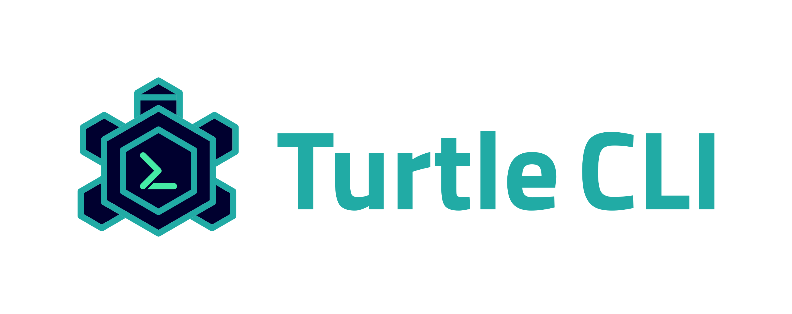

<h3 align=center>
 
</h3>

Turtle CLI is a command line interface for building Expo standalone apps.
You can use it both on your CI and your private computer.

- [Changelog](CHANGELOG.md)
- [Contributing](CONTRIBUTING.md)
- [Development](DEVELOPMENT.md)
- [Code of Conduct](CODE_OF_CONDUCT.md)

## Installation

[Installation instructions and documentation here.](https://docs.expo.dev/distribution/turtle-cli/)

## Usage example

See the [expo/turtle-cli-example](https://github.com/expo/turtle-cli-example) repository to learn how to use Turtle CLI in order to build Expo standalone apps on your CI.

## Do you need help?

- Make sure you've read [the Expo Docs](https://docs.expo.dev/), especially [Building Standalone Apps on Your CI
  ](https://docs.expo.dev/versions/latest/distribution/turtle-cli) and [Building Standalone Apps](https://docs.expo.dev/versions/latest/distribution/building-standalone-apps) guides.
- Search for existing GitHub issues [in this repository](https://github.com/expo/turtle/issues) and in [expo/expo](https://github.com/expo/expo/issues) repository.
- Ask for help in **one** of the following ways:
  - create [a GitHub issue](https://github.com/expo/turtle/issues/new).
  - create a new topic on the [Expo Forums](https://forums.expo.dev/).
  - connect with the community on the [Expo Developers Discord](http://chat.expo.dev).

## License

The Turtle CLI source code is made available under the [MIT license](LICENSE).
Some of the dependencies are licensed differently, with the BSD license, for example.
